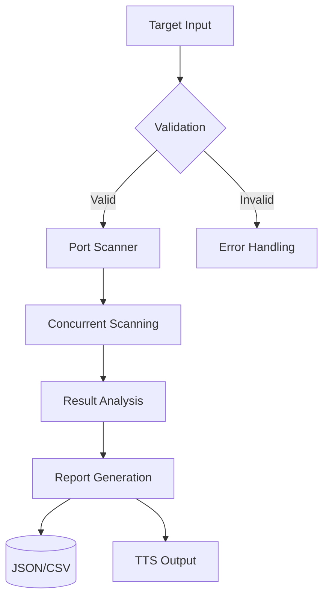

<div align="center">

  <br>
</div>


<p align="center">
   
  
  
</p>

---

🌟 Try It Now!

```bash
# Clone the tool
git clone https://github.com/AkarshYash/Advanced-Recon-Explorer-ARX-
cd cyber-recon-exploiter

# Run a quick test on a safe vulnerable site
python scanner.py --target http://testphp.vulnweb.com
````

> 🛡️ Legal Note: Scan only systems you own or have *explicit* permission to test. Recommended practice target:
>
> * [http://testphp.vulnweb.com](http://testphp.vulnweb.com)

---

## 🚀 Tech Stack

<table align="center">
  <tr>
    <td align="center" width="150">
      <br><b>Python 3.8+</b>
    </td>
    <td align="center" width="150">
      <br><b>Tkinter GUI</b>
    </td>
    <td align="center" width="150">
      <br><b>Sockets</b>
    </td>
  </tr>
  <tr>
    <td align="center" width="150">
      <br><b>Multithreading</b>
    </td>
    <td align="center" width="150">
      <br><b>Cross-Platform</b>
    </td>
    <td align="center" width="150">
      <br><b>Automation</b>
    </td>
  </tr>
</table>

---

🔍 Features Breakdown

1. 🚪 **Intelligent Port Scanning**

```python
with ThreadPoolExecutor(max_workers=50) as executor:
    futures = {executor.submit(scan_port, ip, port): port for port in TOP_PORTS}
```

* Fast scan of *50+ top ports*
* Banner grabbing & service fingerprinting
* CVE detection via NIST NVD API

---

2. 🗣️ **Voice-Guided Alerts**

```python
engine = pyttsx3.init()
engine.say(f"Port {port} running {service} has {risk} risk!")
```

* TTS vulnerability summaries
* Real-time voice alerts for **critical/high risk** ports

---

3. 🎯 **Exploit Recommendations**

| Port | Service | Risk   | Suggested Tools   |
| ---- | ------- | ------ | ----------------- |
| 22   | SSH     | High   | Hydra, Metasploit |
| 80   | HTTP    | Medium | Nikto, SQLmap     |
| 21   | FTP     | High   | Nmap, Medusa      |

---

📊 Architecture Overview



---

🛠️ Installation

```bash
# 1. 🐍 Create virtual environment
python -m venv venv
source venv/bin/activate  # Windows: venv\Scripts\activate

# 2. 📦 Install dependencies
pip install -r requirements.txt

# 3. 🚀 Launch the tool
python scanner.py
```

---

📜 Ethical Usage Policy

> ⚠️ This tool is strictly for:
>
> * Educational research
> * Authorized penetration testing
> * Lab environments
>   ❌ Do *NOT* use on unauthorized targets.

---

💡 Contributing

<a href="https://github.com/AkarshYash/cyber-recon-exploiter/graphs/contributors">
  
</a>

```bash
# Getting started
git clone https://github.com/AkarshYash/cyber-recon-exploiter
cd cyber-recon-exploiter
git checkout -b feature/NewFeature

# Make your magic 🪄
git commit -m "✨ Added NewFeature"
git push origin feature/NewFeature

# Submit a PR 🧠
```

---

📬 Contact Me

<div align="center">
  <a href="https://www.linkedin.com/in/akarsh-chaturvedi-259271236">
    
  </a>
  <a href="https://github.com/AkarshYash">
    
  </a>
</div>


Off screen recording for the demo. 

https://github.com/user-attachments/assets/3d8d98f1-4f6a-4ee4-b714-d80705a45958


