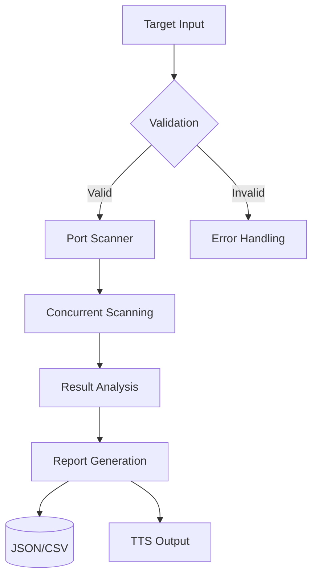

```markdown
<!-- Animated 3D Header with Lightning Effect -->
<div align="center">
  
  <br>
  
</div>

<!-- Glowing Badges -->
<p align="center">
   
  
  
</p>

---

🌟 Try It Now!
```bash
# Clone with 3D effect
git clone https://github.com/AkarshYash/Advanced-Recon-Explorer-ARX-
cd cyber-recon-exploiter

Test on a safe vulnerable site (Recommended)
python scanner.py --target http://testphp.vulnweb.com
```
>  Legal Note: Only scan systems you own or have permission to test. For practice, use:
> - [http://testphp.vulnweb.com](http://testphp.vulnweb.com)

---

🚀 Technologies Used
<table align="center">
  <tr>
    <td align="center" width="150">
      
      <br><b>Python 3.8+</b>
    </td>
    <td align="center" width="150">
      
      <br><b>Tkinter GUI</b>
    </td>
    <td align="center" width="150">
      
      <br><b>Socket</b>
    </td>
  </tr>
  <tr>
    <td align="center">
      
      <br><b>Multi-Threading</b>
    </td>
    <td align="center">
      
      <br><b>Cross-Platform</b>
    </td>
    <td align="center">
      
      <br><b>Automation</b>
    </td>
  </tr>
</table>

---

## 🔍 **In-Depth Features**
### **1. Intelligent Port Scanning**
```python
# Concurrent scanning engine
with ThreadPoolExecutor(max_workers=50) as executor:
    futures = {executor.submit(scan_port, ip, port): port for port in TOP_PORTS}
```
- Scans *50+ critical ports* with risk assessment
- Banner grabbing and service detection
- CVE correlation via NIST NVD API

2. Voice-Guided Reporting
```python
engine = pyttsx3.init()
engine.say(f"Port {port} running {service} has {risk} risk!")
```
- TTS vulnerability summaries
- Priority-based alerts (Critical/High/Medium)

3. Exploit Intelligence
| Port | Service | Risk  | Suggested Tools |
|------|---------|-------|-----------------|
| 22   | SSH     | High  | Hydra, Metasploit |
| 80   | HTTP    | Medium| Nikto, SQLmap |

---

 📊 Project Architecture


 🛠️ Installation Guide
```bash
# Step-by-step with emoji animation
echo "1. 🐍 Create virtual environment"
python -m venv venv
source venv/bin/activate  # Linux/macOS

echo "2. 📦 Install dependencies"
pip install -r requirements.txt

echo "3. 🚀 Launch the tool"
python scanner.py
```

---

📜 Ethical Usage Policy
> ⚠️ This tool must only be used for:
> - Authorized penetration testing
> - Security research
> - Educational purposes
> ❌ Illegal use is strictly prohibited


💡 Contributing
<a href="https://github.com/AkarshYash/cyber-recon-exploiter/graphs/contributors">
  
</a>

1. Fork the repository
2. Create your feature branch (`git checkout -b feature/AmazingFeature`)
3. Commit your changes (`git commit -m 'Add some AmazingFeature'`)
4. Push to the branch (`git push origin feature/AmazingFeature`)
5. Open a Pull Request


📬 Contact
<div align="center">
  <a href="https://www.linkedin.com/in/akarsh-chaturvedi-259271236">
    
  </a>
  <a href="https://github.com/AkarshYash">
    
  </a>
</div>

Off screen recording for the demo. 

https://github.com/user-attachments/assets/3d8d98f1-4f6a-4ee4-b714-d80705a45958


